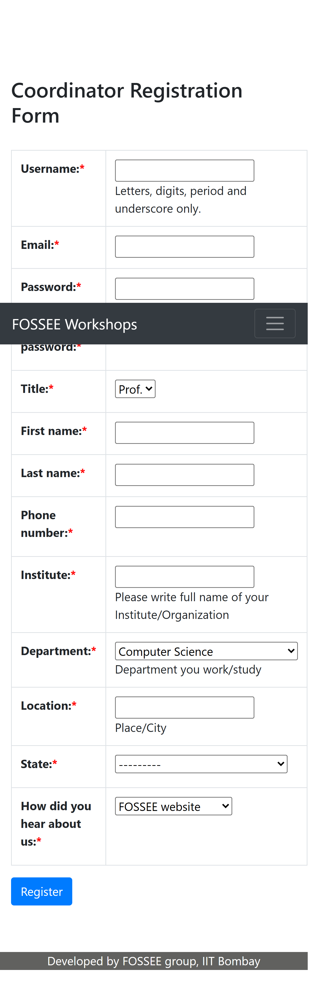
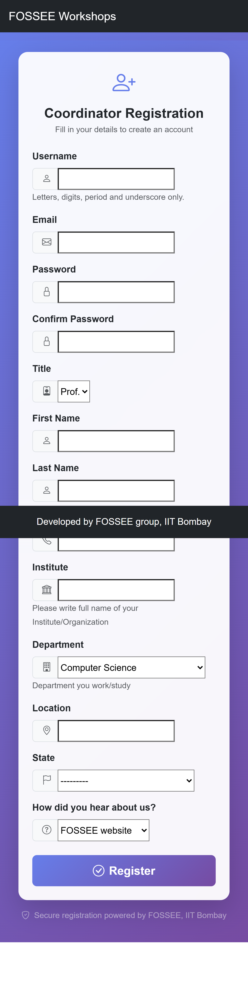
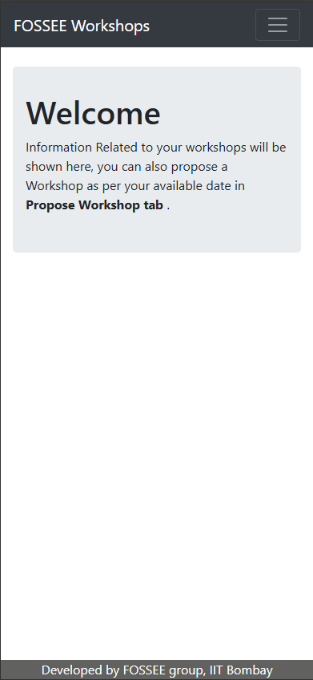
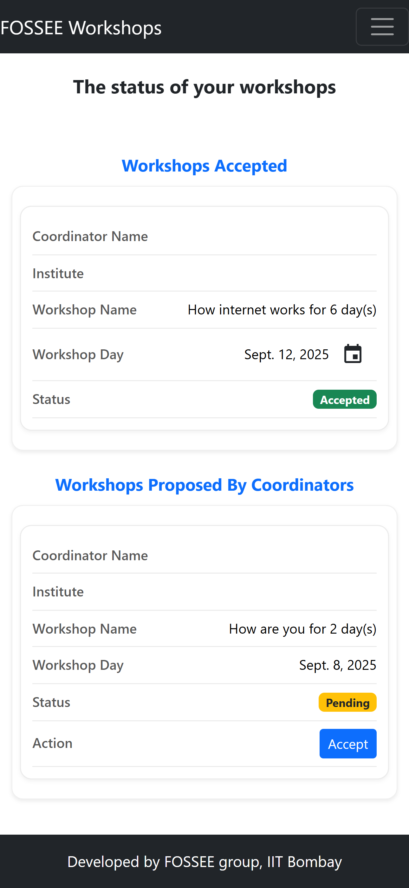
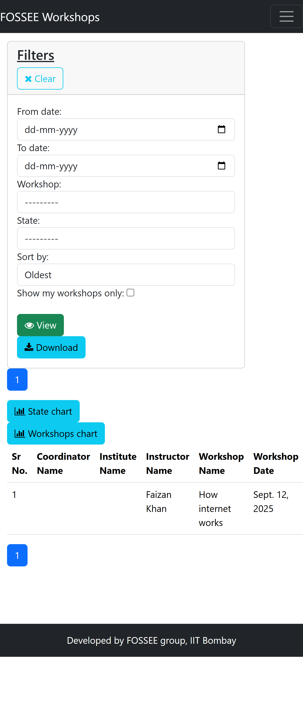
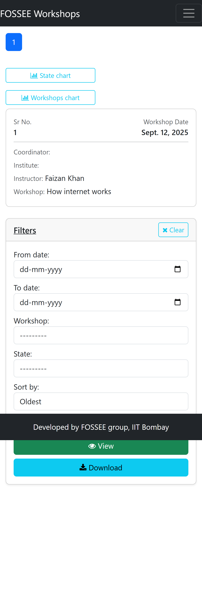
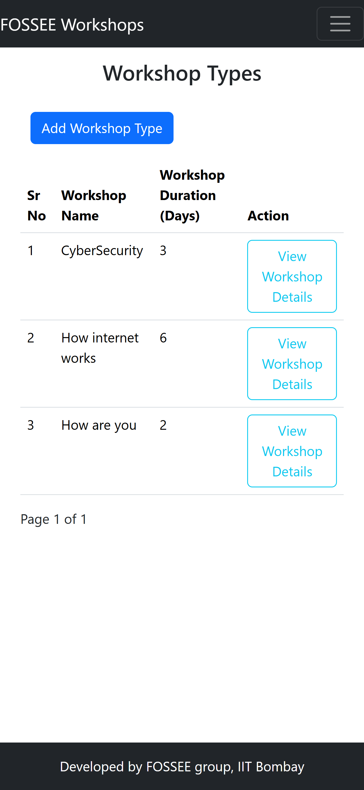
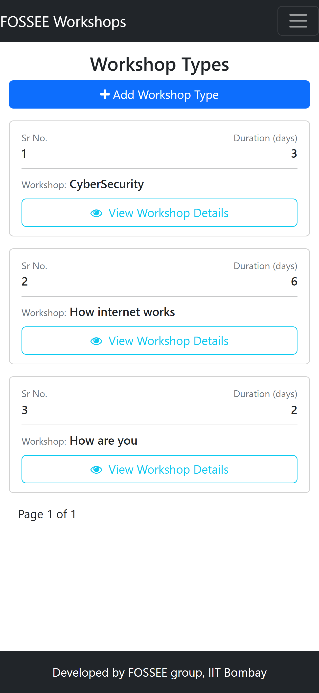
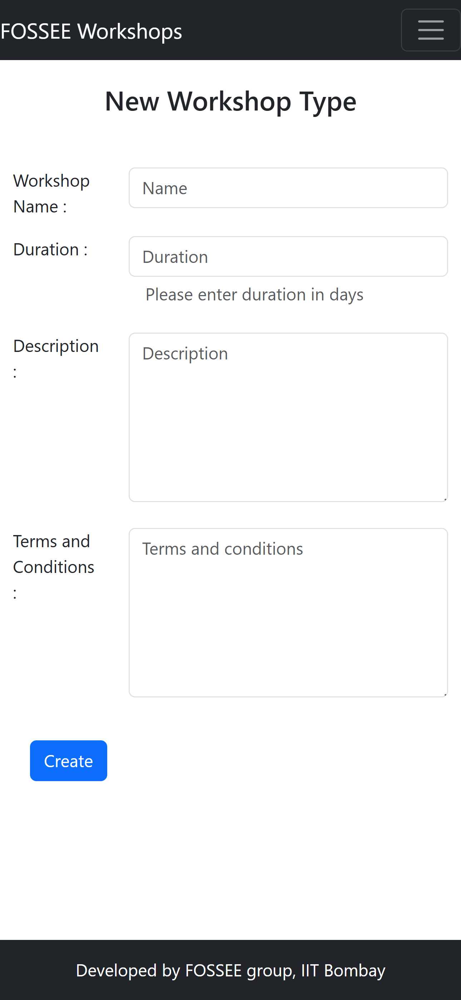
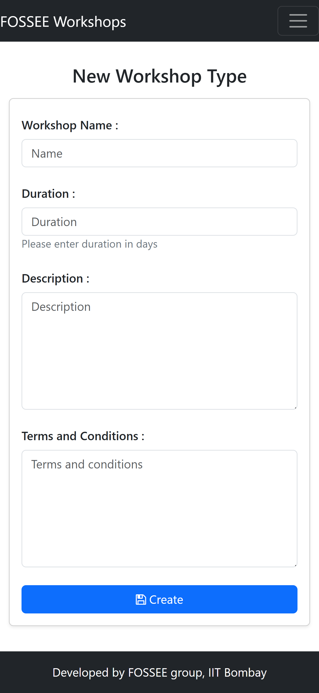

# Workshop Booking – UI/UX Enhancement

This repository contains my submission for **FOSSEE Python Screening Task 1: UI/UX Enhancement**.  
The task was to improve the look and feel of the [Workshop Booking application](https://github.com/FOSSEE/workshop_booking) without altering its core functionality.

---

## 1️⃣ Setup Instructions

Follow these steps to run the project locally:

1. **Clone the repository**
   ```bash
   git clone https://github.com/Faizan-9077/workshop_booking.git
   cd workshop_booking
   ```

2. **Create and activate a virtual environment**
   ```bash
   python3 -m venv venv
   # On Windows:
   venv\Scripts\activate
   # On macOS/Linux:
   source venv/bin/activate
   ```

3. **Install dependencies**
   ```bash
   pip install -r requirements.txt
   ```

4. **Apply migrations**
   ```bash
   python manage.py migrate
   ```

5. **Create superuser (only first time)**
   ```bash
   python manage.py createsuperuser
   ```

6. **Run the server**
   ```bash
   python manage.py runserver
   ```

7. **Open in browser**
   ```
   http://127.0.0.1:8000/
   ```

---

## 2️⃣ What I Changed

- **CSS Enhancements:** Improved responsiveness, readability, and consistency across multiple pages (login, register, profile, dashboard, workshop status).  
- **Template Improvements:** Updated `base.html` with a responsive navbar and footer; refined form layouts and spacing in templates.  
- **Code Cleanup:** Removed unnecessary comments from CSS and templates for a cleaner codebase.

---

## 3️⃣ Design Principles Followed

- **Clarity & Readability** → Improved typography, spacing, and alignment.  
- **Consistency** → Unified buttons, forms, and colors across all pages.  
- **Mobile-first Approach** → Designed layouts to work well on small screens first.  
- **Accessibility** → Ensured proper color contrast and semantic HTML usage.

---

## 4️⃣ Ensuring Responsiveness

- Integrated **Bootstrap 5** grid system for layout control.  
- Used **flexbox and media queries** for smoother resizing.  
- Tested on **mobile, tablet, and desktop** viewports.  

---

## 5️⃣ Trade-offs Between Design and Performance

- Adding Bootstrap slightly increased CSS size but provided **consistent responsive behavior**.  
- Avoided heavy JS libraries to keep load times fast.  
- Kept custom CSS minimal and avoided duplication to ensure maintainability.

---

## 6️⃣ Challenges Faced

- Refactoring **table-based layouts** into **card-based layouts** without breaking Django logic.  
- Making **profile and workshop status pages** readable on smaller screens.  
- Ensuring that Django’s **template inheritance** remained intact after restructuring.  

---

## 7️⃣ Visual Showcase

### Login Page
<p align="center">
  
  
</p>

### Register Page
<p align="center">
  
  
</p>

### Dashboard
<p align="center">
  
  
</p>

### Workshop Statistics
<p align="center">
  
  
</p>

### Workshop Type List
<p align="center">
  
  
</p>

### Add Workshop Type
<p align="center">
  
  
</p>


---

## 8️⃣ Submission Checklist

- [x] Code is readable and structured  
- [x] Git history shows progressive work  
- [x] README includes reasoning + setup instructions  
- [x] Screenshots added  
- [x] Comments cleaned up  

---

## 9️⃣ Submission

This repository is my submission for **FOSSEE Python Internship – UI/UX Enhancement Task**.  
The GitHub link has been shared with **pythonsupport@fossee.in** as instructed.

---

💡 *My focus was to make the website cleaner, more user-friendly, and mobile-responsive, while maintaining performance.*
